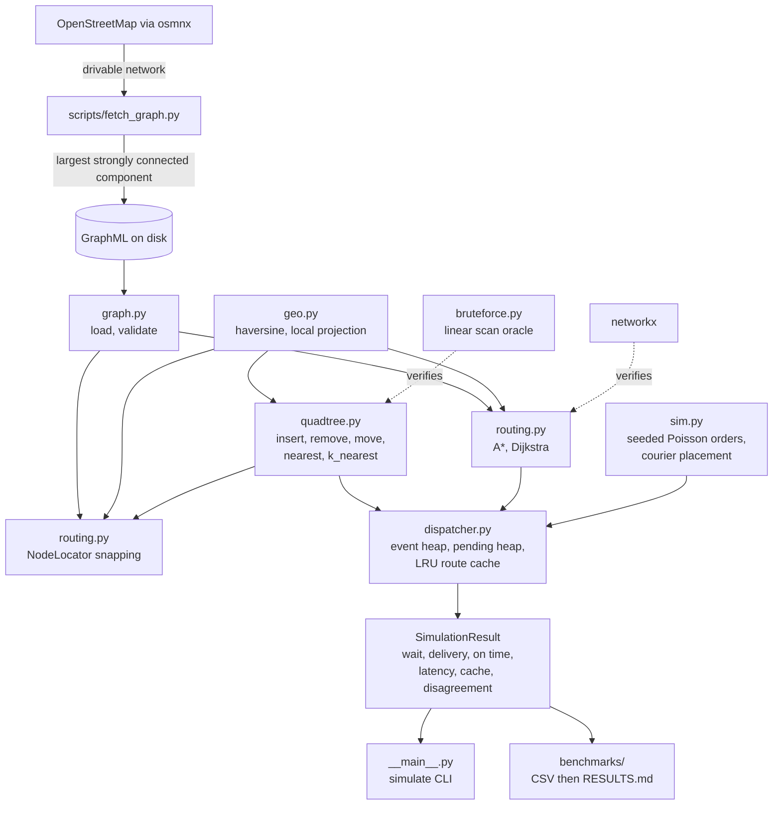

# Dispatch Core

[](https://github.com/beaprogram/dispatch-core/actions/workflows/ci.yml)

A delivery dispatch engine built on the real Halifax road network. It downloads the
drivable street graph from OpenStreetMap, indexes courier positions in a quadtree
written from scratch, routes with a hand written A* over one way streets, and assigns
orders through an event driven simulation with a deadline ordered priority queue.
Every number in this README comes from a benchmark in
[benchmarks/results/RESULTS.md](benchmarks/results/RESULTS.md), which is generated
from committed CSVs and never edited by hand.

## Architecture



## What is built from scratch

The quadtree, A*, Dijkstra, the dispatcher, and the LRU route cache are all written
in this repository. networkx is used only as a graph container and as a test oracle.
osmnx is used only to download and load the map. No library provides the nearest
neighbour search, the pathfinding, or the assignment logic.

## Results

Measured on Apple M4, Darwin 27.0.0, arm64, Python 3.14.0, 2026-09-22.
Median of 5 repeats after 1 warmup, `time.perf_counter_ns`.

### Nearest neighbour, 1,000 queries

| distribution | n | build | quadtree nearest | linear scan | speedup | mean distance checks |
| --- | ---: | ---: | ---: | ---: | ---: | ---: |
| uniform | 1,000 | 0.9 ms | 5.00 ms | 66.16 ms | 13.2x | 8.4 |
| uniform | 10,000 | 12.9 ms | 6.98 ms | 652.93 ms | 93.5x | 8.4 |
| uniform | 100,000 | 167.9 ms | 8.52 ms | 6573.68 ms | 771.9x | 9.9 |
| clustered | 1,000 | 1.1 ms | 5.16 ms | 65.08 ms | 12.6x | 9.8 |
| clustered | 10,000 | 14.0 ms | 7.28 ms | 645.28 ms | 88.6x | 10.6 |
| clustered | 100,000 | 200.8 ms | 10.26 ms | 6426.06 ms | 626.2x | 11.4 |

A hundredfold increase in point count raises mean distance checks per query from 8.4
to 9.9. Clustered points, sampled from real road nodes with jitter, cost more than
uniform ones at every size, because road shaped density produces deeper and denser
leaves.

### Routing, 200 seeded pairs on the 3,505 node graph

| weight | algorithm | median total | mean nodes expanded |
| --- | --- | ---: | ---: |
| length | A* | 269.9 ms | 537.1 |
| length | Dijkstra, this repo | 576.2 ms | 1623.6 |
| length | Dijkstra, networkx | 364.1 ms | not instrumented |
| travel_time | A* | 522.8 ms | 1075.6 |
| travel_time | Dijkstra, this repo | 627.6 ms | 1630.4 |
| travel_time | Dijkstra, networkx | 378.3 ms | not instrumented |

On `length` the haversine heuristic cuts mean expansions 3.02 times, from 1623.6 to
537.1, and A* finishes 2.13 times faster than the same code with a zero heuristic.
On `travel_time` the heuristic is weaker, cutting expansions only 1.52 times, for the
reason given under limitations.

### Dispatch, 1,000 orders, 200 couriers, 18 orders per minute, 5 seeds

| metric | nearest | topk-eta |
| --- | --- | --- |
| mean wait | 447.4 s (min 359.1, max 523.8) | 432.5 s (min 353.4, max 527.4) |
| p95 wait | 1234.1 s (min 1094.9, max 1328.5) | 1213.9 s (min 1065.7, max 1397.2) |
| mean delivery | 1433.7 s (min 1309.9, max 1535.5) | 1413.4 s (min 1300.9, max 1551.8) |
| p95 delivery | 2492.6 s (min 2312.0, max 2617.4) | 2505.1 s (min 2358.8, max 2672.2) |
| on time | 97.2 % (min 95.9, max 98.2) | 97.5 % (min 95.5, max 98.4) |

No metric shows a difference between the two strategies larger than the spread
between seeds. See the section below.

| strategy | p50 decision latency | p95 decision latency | mean order inter-arrival | route cache hit rate |
| --- | ---: | ---: | ---: | ---: |
| nearest | 0.0013 ms | 0.0066 ms | 3481 ms | 0.01 % |
| topk-eta | 2.2349 ms | 9.7495 ms | 3481 ms | 24.75 % |

The route cache is near useless for `nearest`, which issues two routes per order
between endpoints drawn uniformly from 3,505 nodes, so a repeated node pair almost
never occurs. `topk-eta` routes five candidates per decision and candidate couriers
recur across nearby pickups, which is where its hits come from.

## What did not work, and how I know

The hypothesis was that picking couriers by straight line distance would be visibly
worse than picking by road travel time, because the Halifax graph spans both sides of
the harbour and a courier a short distance away across water can be a long drive
away. The `topk-eta` strategy takes the five nearest couriers by straight line and
then routes each one, choosing the lowest actual travel time.

The strategy does change decisions, and the local effect is real. At the 200 courier
baseline it overrides the straight line nearest courier on 9.10 percent of decisions,
and on those decisions it saves a mean of 57.3 seconds of travel time. The couriers it
rejects take 0.2690 road seconds per straight line meter against 0.1142 for the ones
it picks, so the straight line genuinely was understating their real route.

That local gain does not survive to the system level. Across 4 courier counts, 5
metrics, and 5 seeds, not one comparison between the strategies produced
non-overlapping per seed ranges:

| couriers | mean delivery, nearest | mean delivery, topk-eta | exceeds seed spread |
| ---: | --- | --- | --- |
| 50 | 9401.0 s (min 9152.6, max 9733.8) | 9415.3 s (min 9208.9, max 9749.6) | no, ranges overlap |
| 100 | 4070.8 s (min 3957.1, max 4231.1) | 4048.9 s (min 3942.9, max 4256.3) | no, ranges overlap |
| 200 | 1433.7 s (min 1309.9, max 1535.5) | 1413.4 s (min 1300.9, max 1551.8) | no, ranges overlap |
| 400 | 684.4 s (min 676.1, max 699.5) | 676.2 s (min 667.5, max 691.3) | no, ranges overlap |

The arithmetic explains why. A 57.3 second saving on 9.10 percent of orders is about
5 seconds per order, against a mean delivery near 1433.7 seconds. Meanwhile the seed
to seed spread in mean delivery for a single strategy at 200 couriers is 225.6
seconds, being 1535.5 minus 1309.9 from the table above, which is eleven times larger
than the 20.3 second gap between the strategy means. The order stream varies more
than the assignment rule does.

**The method is the point here.** Seed 42 is the documented default. Had I run it
alone, this is what I would have reported:

| seed | nearest | topk-eta | difference |
| ---: | ---: | ---: | ---: |
| 42 | 1404.6 s | 1370.2 s | topk-eta better by 2.45 % |
| 43 | 1535.5 s | 1551.8 s | topk-eta worse by 1.06 % |
| 44 | 1426.1 s | 1379.6 s | topk-eta better by 3.26 % |
| 45 | 1309.9 s | 1300.9 s | topk-eta better by 0.69 % |
| 46 | 1492.2 s | 1464.4 s | topk-eta better by 1.87 % |

A single run on the default seed would have produced a 2.45 percent improvement, and
a single run on seed 43 would have produced a 1.06 percent regression. Neither is a
finding. Running five seeds and reporting the spread is what turns an anecdote into a
result I can defend.

A paired comparison, which is more sensitive because both strategies receive
identical generated inputs for a given seed, does detect a small consistent effect:
`topk-eta` wins mean delivery on 4 of 5 seeds at both 100 and 200 couriers, by about
20 seconds, and on 5 of 5 at 400 couriers by 8.25 seconds. At 50 couriers it reverses
and `nearest` wins on 4 of 5. So the honest summary is that the effect is directional
and tiny, not that the strategy is better.

I also tested the specific harbour explanation and it was wrong. Of 92 disagreement
decisions in the baseline run, only 4 rejected a courier on the far side of the
harbour, and those accounted for 6.36 percent of the total travel time saved. Sampling
node pairs directly agreed: of the 50 pairs with the worst ratio of road time to
straight line distance, 10 crossed mid harbour, which is 20 percent, while 37.92
percent of all 1,200 sampled pairs did, so crossing the water is if anything a
negative predictor of a bad straight line estimate. The corrections `topk-eta` makes are local road topology, one way systems
and divided roads and loop backs, not water crossings. The largest single case was a
courier 553 metres away in a straight line that needed 493 seconds by road, against
one 655 metres away that needed 69 seconds.

What would have to change for this to matter: sustained load past saturation where
queueing dominates and a better first choice compounds, a sparser fleet where the
five candidates are far apart rather than interchangeable, or a geography with larger
forced detours than downtown Halifax provides. The disagreement rate does climb with
fleet size, from 1.06 percent at 50 couriers to 32.22 percent at 400, but 400
couriers is exactly the regime where nothing queues and every order is already on
time, so the better choice has nothing left to improve.

## Correctness

Each component is checked against an oracle computed a different way, so a shared
mistake cannot hide.

| component | oracle |
| --- | --- |
| quadtree `nearest`, `k_nearest`, `within_radius` | `bruteforce.py`, an independent linear scan |
| A* and Dijkstra costs | `networkx.shortest_path_length`, relative tolerance 1e-9, 200 seeded pairs, both weights |
| local projection | haversine distance, which is computed from a different formula |
| coordinate snapping | linear scan over projected nodes, and separately over haversine distance |

Property tests generated by Hypothesis compare distances rather than identifiers,
because points equidistant from a query are all correct answers. CI runs a
derandomized Hypothesis profile so a failure on a build machine reproduces exactly.

Two bugs got past the tests that existed at the time, and both are worth naming.

A round trip test hid an error in the projection. `project_to_local` multiplied
degree offsets by the earth radius without converting to radians, making every
projected distance roughly 57 times too large, and `unproject_from_local` divided by
the same wrong scale, so projecting and unprojecting returned the original
coordinates exactly. Only comparing projected distance against haversine, an
independent formula, exposed it. The worst relative error is now 0.0138 percent over
a 5 km disc.

Correctness tests could not verify the pruning. Every quadtree property test compares
answers against brute force, so an implementation that ignored its own structure and
scanned every point would pass all of them. Replacing the bounding box lower bound
with a constant zero disables pruning entirely, and under that mutation the brute
force comparison tests still passed. A test asserting the work done rather than the
answer, mean distance checks per query under 5 percent of n, fails immediately at
10000.0 against a budget of 500. Asserting the answer and asserting the work are
different tests.

## Design decisions

**Quadtree against k-d tree against uniform grid.** Couriers move constantly, so the
structure has to support cheap insert and remove, not just bulk build. A k-d tree
gives better balance on static point sets but needs rebalancing or rebuilding as
points move. A uniform grid handles movement well and is simple, but courier density
on a road network varies by more than an order of magnitude between downtown and the
edge of the graph, so a single cell size is either too coarse downtown or mostly
empty elsewhere. A region quadtree adapts its resolution to local density and
supports remove and move directly, which is what this workload needs. The cost is
sensitivity to degenerate inputs, covered under limitations.

**Why the heuristics are admissible.** For `length`, the heuristic is the haversine
distance to the target. A road cannot be shorter than the straight line between its
endpoints, so the estimate never exceeds the true remaining distance. For
`travel_time`, it is that same distance divided by the fastest edge speed in the
graph, which is the time the trip would take if the whole route were the fastest road
available, and nothing real can beat that. Both are in fact consistent, the stronger
property, which is what makes the closed set safe: a node's cost is final the first
time it is expanded, so it never needs reopening. This was measured rather than
assumed. The worst slack of `w(u, v) + h(v) - h(u)` over every edge for 25 sampled
targets is positive on both graphs and both weights, so no scaling correction was
needed.

**Why top-k refinement.** Straight line distance is cheap and roughly correlates with
travel time, but the correlation breaks wherever the road network forces a detour.
Routing every free courier would be correct and far too slow. Taking the k nearest by
straight line and routing only those bounds the work at k searches per decision while
still catching the cases where the straight line misleads. The measured result is
that it does catch them, and that catching them does not move the system level
metrics, which is the finding above rather than an argument against the design.

**Local projection error.** The quadtree works in flat metres produced by an
equirectangular projection around the centre of the graph, while routing costs are
great circle based. Over a 5 km radius the worst relative error between projected
Euclidean distance and haversine is 0.0138 percent, measured on an 81 by 81 grid.
That is far below the difference between candidate couriers in any real decision, so
the flat approximation does not change which courier is chosen.

## Complexity

n is points in the quadtree, V and E are graph nodes and edges, m is the size of a
target leaf, k is the number of candidates.

| operation | average | worst case |
| --- | --- | --- |
| quadtree insert | O(log n) | O(max_depth) |
| quadtree remove, move | O(log n) | O(max_depth + m) |
| quadtree nearest | O(log n) | O(n) |
| quadtree k_nearest | O(k log n) | O(n log k) |
| quadtree within_radius | O(log n + reported) | O(n) |
| quadtree build from n points | O(n log n) | O(n max_depth) |
| A* and Dijkstra | much less than the worst case when the heuristic is informative | O(E log V) |
| dispatch decision, nearest | O(log n) | O(n) |
| dispatch decision, topk-eta | O(k log n) plus k routes, cached | O(n log k) plus k routes |
| route cache lookup | O(1) | O(1) |

## How to run

```bash
make install          # editable install plus dev dependencies
make test             # pytest with coverage
make lint             # ruff check, ruff format check, mypy
make fetch            # download the 5000 m benchmark graph, needs internet
make fetch-fixture    # download the 800 m test fixture, needs internet
make bench            # run all benchmarks and regenerate RESULTS.md
make results          # regenerate RESULTS.md from existing CSVs
```

Run a simulation:

```bash
python -m dispatch_core simulate \
  --graph data/cache/halifax_5000m.graphml \
  --couriers 200 --orders 1000 --seed 42 \
  --strategy topk-eta --k 5
```

Tests read only the committed 800 m fixture and never touch the network. One test
breaks `socket.connect` before loading the fixture so that an accidental download
fails the suite rather than passing quietly.

## Testing approach

153 tests, of which quadtree and routing and dispatcher modules are at 100 percent
statement coverage. Three kinds of test carry most of the weight.

Property tests over Hypothesis generated inputs compare the quadtree against a linear
scan on distances, so ties do not cause false failures. Invariant tests assert
properties the simulation must never violate: every order assigned exactly once, no
courier holding two orders at once, assignment never before creation, and the pending
queue popping in deadline order, the last checked with a single courier so that
orders genuinely queue. Work budget tests assert how much work was done rather than
what answer came back, which is the only kind that catches a structure being bypassed.

## Limitations

**networkx outperforms the Dijkstra in this repository.** On `length`, networkx
finishes 200 pairs in 364.1 ms against 576.2 ms here, 1.58 times faster. On
`travel_time` it takes 378.3 ms against 627.6 ms, 1.66 times faster, and it also
beats this repository's A* on that weight, 378.3 ms against 522.8 ms. The hand
written A* wins only on `length`, at 269.9 ms, where cutting expansions 3.02 times
overcomes the gap. This is a constant factor difference, not an algorithmic one: the
search here walks networkx adjacency dictionaries and takes a minimum over parallel
edges inside the inner loop, while networkx routes over its own optimised structures.
Converting the graph once into flat adjacency lists with parallel edge minima
precomputed would close most of it without changing the algorithm. Within the scope
of this project I prioritised correctness, instrumentation, and measurement over
constant factors, and left the gap measured and documented rather than quietly
optimised away.

**The travel_time heuristic is loose on graphs with mixed road classes.** It divides
by the fastest edge anywhere in the graph. On the full graph a single 90 kph edge out
of 8,915 sets the divisor for every estimate, 2.19 times the median street speed, so
the estimate is very optimistic on downtown streets and cuts expansions only 1.52
times against 3.02 for `length`. ALT, meaning A* with landmarks and the triangle
inequality, would give a tighter admissible bound from real road times. It is not
implemented here.

**No traffic model.** Edge speeds come from OpenStreetMap tags with osmnx inference.
There is no congestion, no time of day variation, and no turn cost or turn
restriction beyond one way directionality.

**Straight line candidates can miss the true road nearest courier.** Both strategies
select candidates by straight line distance. `topk-eta` then reranks by road time,
but only within those k candidates, so a courier that is road-close and straight line
far is never considered by either strategy.

**Single process, single machine.** The simulation runs in one process and the route
cache lives in memory. There is no persistence, no concurrency, and no distribution.

**Degenerate inputs defeat quadtree pruning.** Coincident points pile into one leaf at
`max_depth` and are scanned in full. A query at the centre of a ring of equidistant
points also defeats pruning, because every box holding ring points extends toward the
query and none can be discarded: measured on a ring of 8,000 points, one query
checked 7,998 of them.

**Simulation, not production.** Orders and courier placements are generated, not
observed. The metrics describe this model under these assumptions.

## Roadmap

- Batched assignment, solving an assignment problem over a window of pending orders
  rather than greedily one at a time, which is where a smarter rule is most likely to
  produce a system level gain given the finding above.
- Real time map over WebSocket, showing courier positions and live assignment.
- Accessible operator interface, keyboard navigable and screen reader labelled, with
  status conveyed by text and shape rather than colour alone.
- ALT landmarks for a tighter admissible travel time bound.
- Compact adjacency lists to close the constant factor gap against networkx.

## How AI was used

*Drafted factually from how this project was actually built. Marked for review before
publication.*

This project was built with Claude acting as a pair programmer, in checkpoints that I
specified and reviewed. I wrote the specification for each checkpoint, including the
data structures to implement from scratch, the tests required, and the constraints,
then reviewed the output and approved each one before the next began.

Working rules I set and enforced: no number appears in documentation unless it comes
from a benchmark or test run in this repository, every core data structure and
algorithm is written here rather than imported, and correctness is verified against an
independent oracle rather than against a second copy of the same logic.

Several defects were caught by that process rather than by review of the code. The
projection bug was found because I required an oracle based test rather than a round
trip test. The absent pruning verification was found because I asked whether a
correctness test could distinguish a working quadtree from one that scans, and it
could not. The dispatch simulation was initially configured so that no order ever
queued, which made the priority queue untested while every metric still looked
healthy, and this was caught by checking whether the measurement actually exercised
the structure. The strategy comparison in this README is reported as a negative
result because five seeds were required rather than one.

Decisions about scope, the checkpoint structure, the measurement methodology, and
what counts as an acceptable claim were mine. The implementation was written
collaboratively, and every line was reviewed before it was committed.

## Attribution

Map data from [OpenStreetMap](https://www.openstreetmap.org/) contributors, available
under the [Open Database License](https://opendatacommons.org/licenses/odbl/).

## License

MIT. See [LICENSE](LICENSE).
